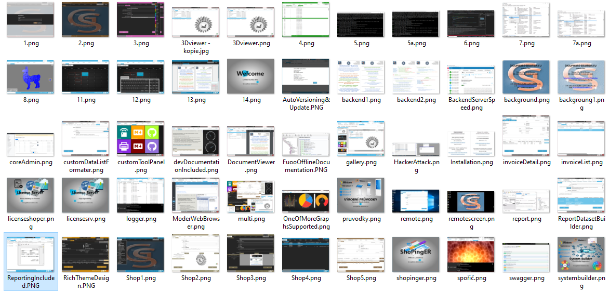

# Dokumentace **EasySYSTEMbuilder** to je GroupWare
Krátký Úvod pro seznámení s Projektem Easy SYSTEM buider a jeho významu a přínosem pro celý svět.

**Aktuální verzi [EasySYSTEMBuilder](http://KlikneteZde.cz:8000) můžete vyzkoušet online.**  
**Další informace o projektech EIC a ESB na Portálu [KlikneteZde.cz](http://KlikneteZde.cz)**

## **Co je EasySYSTEMbuilder?**
**EASY-SYSTEM-BUILDER [ESB]** je C# WPF Visual Studio Projekt zaměřený na 
extrémně snadný a rychlý vývoj JAKÉHOKOLI SYSTÉMU pomocí připravených Šablon Formulářů.

ESB je tak Univerzální SYSTÉMOVÁ ŠABLONA pro další vývoj pouze pomocí grafických Formulářů
a brzy již v Grafickém Studiu, kde se vám FORMULÁŘ i sám Vygeneruje
na základě struktury Dat dané Tabulky [Faktury,seznam adres] a vy jen doladíte.

Systémové šablony jsou stále stejné a vy tedy nemusíte nic než nastavit správně nová políčka.
Vše ostatní je součástí šablony, která obsahuje Obsluhující funkcionality.

**Systém jako takový není totiž Nic jiného než Seznam Formulářů s rozdílnými Daty**.
A přesně takto je postaven **EasySYSTEMbuilder**. 

Dokonale nastavené Jádro systému, spravuje vše další potřebné k plnohodnotnému chodu.
Systém disponuje všemi běžnými funkcionalitami, **Tiskem**, **správou** ,**MultiJazyčností,** **MultiMedia**, **3D**, i jako **Centrální Klient více Serverů najednou** tedy více systémů a mnohem Více. 

Tento Systém je plně kompatibilní s každým možným typem Systému.
Ať už **Informační, Dotykový, Nadstavba, Controling, Reporting, Monitor Hardware, Dotykové Kiosky,
Plánovací či Řidící či Monitorovací Terminály a Systémy, Výrobní Terminály** 
a již Bzy i jako **Ovladací Panely výrobních Strojů SIEMENS**.

A to Zdaleka není jedniná Výhoda. Jen na [Github.com](https://github.com/search?q=C%23%20WPF&type=repositories) máte stovku ne-li 
Tisíce téměř hotových nástrojů, funkcionalit, editorů, prohlížečů, designů, příkladů, nápadů řešení,
která vás posunou Vpřed. 

 
## **Implementované Technologie**

V dnešní Době Frameworků, což se dá nazvat technologií, je nepřeberné množstí možností.
Obecně platí že se používá 1 Framework aby nedocházelo ke kolizi.
Ne v tomto Případě. Frameforků je implementováno hned 5. 
[Metro](https://mahapps.com/), [WPF NET](https://learn.microsoft.com/en-us/dotnet/?view=netdesktop-8.0), [XCEED](https://xceed.com/en/), [WpfLightToolkit](https://github.com/mohachouch/WpfLightToolkit), [HelixToolkit](https://helix-toolkit.github.io/)  Tím máme vyřešeny objekty pro formuláře více  než nadstadartně.

A nejen to, lze implementovat i naprosto rozdílné technologie, 
jako např WEB aplikace pouhým vložením do rámečku Okna Windows a máte novou aplikaci.
Systém totiž hostuje vlastní web server. 
Aktuálně je v Systému implementováno přes 100 pečlivě vybraných technologií,
které nabízí tolik možností, že je není ani možné všechny využít.
 
---

## **Modularní SYSTÉM to jsou jen různé typy Šablon**
Přesně tak. A ty jsou již připraveny pro 90% všech standartních systémů.
A snadno lze vytvořit nové, Díky Internetu je i Sebesložitější Formulář, jen Formulář.

Stříhání Videa je zaimplementováno do týdne. Tak si představte co můžete mít do 1 roku.
Systemé již aktálně funguje jako Administrace celého IT odvětví a malý Fakturační Systém.

Během 5dnů Byl i dodán Dotykový Terminál pro Vykazování práce ve Výrobní společnosti,
Šablony se zkladají z Designu - Ten si snadno upravíte dle již existujícíh Agend,
a obsluhujících funkcionalit, kde jen upravíte nová datová pole.

## **Řešení system EasySYSTEMbuilder obsahuje**
1. 15x Rozšiřující Nástroje, Editory, Generátory, Funkcionality
2. 500+ Objektů pro tvorbu Formlářů pro každý Typ Systému
3. Pluginy - Chystá se Celé Aplikace jako plugin = Formulář, proces(např WorkWlow)
4. 10x Hostované Windows či Jiné nativní Aplikace : React, Electron
5. 20x Hostované Web aplikace spuštěné v jádru systému (web serveru)
6. Multi Pobočkový Fakturační, Nabídkový, Objednávkový Systém s Pokladnou
7. Modul Vykazování Práce ve Výrobě včetně Reportingu
8. Kopletní Správa Serverovýh Agend
9. Emailing,WebBlog, NewsLetter, Notifikace, Privátní Zprávy 
10. Dohledové Centrum
11. Sdílení na Internetu, Live Web Data Monitoring
12. Reporting včetně Report Builderu 
13. Agendy Nástrojů, Hormadných Operací Atd.
14. Kompletní Správa Multimedia Online Dokumentace
15. Licenční Server
16. Komlpetní Správa a Vývoj Web Portálu Online + Dynamické Moduly
17. Pránovač Úloh, Zasílání Emailů, spouštení Procesů, Socket, SQL
18. Calendář

A to není zdaleka vše. Na spoustu věcí mít web nikdy nebude.
Aktuálně Vytvořená správsa serveru včetně webového portálu se spravuje  
snáz z aplikace než přímo z webu. Aktuálně již nyní slouží systém k online
Vývoji webového portálu.

---

# **Technologický List**
Seznam Balíčků rozšiřující Jádro Systému ESB

* avalonia\11.0.0\ref\net461\Avalonia.dll
* avalonia\11.0.0\ref\net461\Avalonia.Base.dll 
* avalonia\11.0.0\ref\net461\Avalonia.Controls.dll
* avalonia\11.0.0\ref\net461\Avalonia.DesignerSupport.dll 
* avalonia\11.0.0\ref\net461\Avalonia.Dialogs.dll
* avalonia\11.0.0\ref\net461\Avalonia.Markup.dll 
* avalonia\11.0.0\ref\net461\Avalonia.Markup.Xaml.dll
* avalonia\11.0.0\ref\net461\Avalonia.Metal.dll 
* avalonia\11.0.0\ref\net461\Avalonia.MicroCom.dll
* avalonia\11.0.0\ref\net461\Avalonia.OpenGL.dll 
* avalonia.remote.protocol\11.0.0\lib\netstandard2.0\Avalonia.Remote.Protocol.dll 
* avalonia.avaloniaedit\11.0.0\lib\netstandard2.0\AvaloniaEdit.dll 
* caliburn.micro.core\2.0.2\lib\net45\Caliburn.Micro.dll
* caliburn.micro\2.0.2\lib\net45\Caliburn.Micro.Platform.dll 
* cefsharp.common\116.0.230\lib\net462\CefSharp.dll
* cefsharp.common\116.0.230\lib\net462\CefSharp.Core.dll 
* cefsharp.wpf\116.0.230\lib\net462\CefSharp.Wpf.dll 
* cefsharp.wpf.hwndhost\116.0.230\lib\net462\CefSharp.Wpf.HwndHost.dll 
* controlzex\3.0.2.4\lib\net462\ControlzEx.dll 
* cyotek.drawing.bitmapfont\2.0.0\lib\net462\Cyotek.Drawing.BitmapFont.dll 
* deviceid\6.6.0\lib\net40\DeviceId.dll 
* deviceid.windows\6.6.0\lib\net40\DeviceId.Windows.dll 
* deviceid.windows.wmi\6.6.0\lib\net40\DeviceId.Windows.Wmi.dll 
* DotNetProjects.DataVisualization.Toolkit.dll 
* dDotNetToolkit.Wpf.Metro.Dialogs.dll 
* dragablz\0.0.3.234\lib\net45\Dragablz.dll 
* fluent.ribbon\10.0.4\lib\net462\Fluent.dll 
* geminiwpf\0.7.0\lib\net45\Gemini.dll 
* gemini.commandline\1.0.3\lib\net40\Gemini.CommandLine.dll 
* gemini.modules.codecompiler\0.7.0\lib\net45\Gemini.Modules.CodeCompiler.dll 
* gemini.modules.codeeditor\0.7.0\lib\net45\Gemini.Modules.CodeEditor.dll 
* gemini.modules.errorlist\0.7.0\lib\net45\Gemini.Modules.ErrorList.dll 
* gemini.modules.grapheditor\0.7.0\lib\net45\Gemini.Modules.GraphEditor.dll 
* gemini.modules.inspector\0.7.0\lib\net45\Gemini.Modules.Inspector.dll 
* gemini.modules.metro\0.5.0\lib\net40\Gemini.Modules.Metro.dll 
* gemini.modules.output\0.7.0\lib\net45\Gemini.Modules.Output.dll 
* gemini.modules.propertygrid\0.7.0\lib\net45\Gemini.Modules.PropertyGrid.dll 
* gemini.services\1.0.2\lib\dotnet5.4\Gemini.Services.dll 
* gu.localization\6.1.0\lib\net45\Gu.Localization.dll 
* gu.wpf.localization\6.1.0\lib\net45\Gu.Wpf.Localization.dll 
* helixtoolkit\2.24.0\lib\netstandard2.0\HelixToolkit.dll 
* helixtoolkit.wpf\2.24.0\lib\net462\HelixToolkit.Wpf.dll 
* helixtoolkit.wpf.input\2.24.0\lib\net462\HelixToolkit.Wpf.Input.dll 
* helixtoolkit.wpf.sharpdx\2.24.0\lib\net462\HelixToolkit.Wpf.SharpDX.dll 
* htmlagilitypack\1.11.53\lib\Net45\HtmlAgilityPack.dll 
* avalonedit\6.3.0.90\lib\net462\ICSharpCode.AvalonEdit.dll 
* icsharpcode.wpfdesigner\8.1.49\lib\net45\ICSharpCode.WpfDesign.dll 
* icsharpcode.wpfdesigner\8.1.49\lib\net45\ICSharpCode.WpfDesign.Designer.dll 
* ICSharpCode.WpfDesign.Designer.ExpressionBlendInteractionAddon.dll 
* ICSharpCode.WpfDesign.XamlDom.dll 
* Itenso.Windows.Controls.ListViewLayout.dll 
* itextsharp.4.1.6.0\4.1.6\lib\itextsharp.dll 
* wpftoolsawesome\1.0.9.2\lib\net45\JPB.WPFToolsAwesome.dll 
* livecharts\0.9.7\lib\net45\LiveCharts.dll 
* livecharts.wpf\0.9.7\lib\net45\LiveCharts.Wpf.dll 
* log4net\2.0.15\lib\net45\log4net.dll 
* mahapps.metro\1.6.5\lib\net46\MahApps.Metro.dll 
* MahApps.Metro.IconPacks.dll 
* MahApps.Metro.IconPacks.BootstrapIcons.dll 
* MahApps.Metro.IconPacks.BoxIcons.dll 
* MahApps.Metro.IconPacks.Codicons.dll 
* MahApps.Metro.IconPacks.Coolicons.dll 
* mahapps.metro.iconpacks.fontawesome\4.11.0\lib\net46\MahApps.Metro.IconPacks.Core.dll 
* MahApps.Metro.IconPacks.Entypo.dll 
* MahApps.Metro.IconPacks.EvaIcons.dll 
* MahApps.Metro.IconPacks.FeatherIcons.dll 
* MahApps.Metro.IconPacks.FileIcons.dll 
* MahApps.Metro.IconPacks.Fontaudio.dll 
* mahapps.metro.iconpacks.fontawesome\4.11.0\lib\net46\MahApps.Metro.IconPacks.FontAwesome.dll 
* MahApps.Metro.IconPacks.Fontisto.dll 
* MahApps.Metro.IconPacks.ForkAwesome.dll 
* MahApps.Metro.IconPacks.Ionicons.dll 
* MahApps.Metro.IconPacks.JamIcons.dll 
* MahApps.Metro.IconPacks.Material.dll 
* MahApps.Metro.IconPacks.MaterialDesign.dll 
* MahApps.Metro.IconPacks.MaterialLight.dll 
* MahApps.Metro.IconPacks.Microns.dll 
* MahApps.Metro.IconPacks.Modern.dll 
* MahApps.Metro.IconPacks.Octicons.dll 
* MahApps.Metro.IconPacks.PicolIcons.dll 
* MahApps.Metro.IconPacks.PixelartIcons.dll 
* MahApps.Metro.IconPacks.RadixIcons.dll 
* MahApps.Metro.IconPacks.RemixIcon.dll 
* MahApps.Metro.IconPacks.RPGAwesome.dll 
* MahApps.Metro.IconPacks.SimpleIcons.dll 
* MahApps.Metro.IconPacks.Typicons.dll 
* MahApps.Metro.IconPacks.Unicons.dll 
* MahApps.Metro.IconPacks.VaadinIcons.dll 
* MahApps.Metro.IconPacks.WeatherIcons.dll 
* MahApps.Metro.IconPacks.Zondicons.dll 
* mahapps.metro.simplechildwindow\1.5.0\lib\net45\MahApps.Metro.SimpleChildWindow.dll 
* xaml.mapcontrol\9.0.1\lib\net462\MapControl.WPF.dll 
* microcom.runtime\0.11.0\lib\netstandard2.0\MicroCom.Runtime.dll 
* microsoft.bcl.asyncinterfaces\8.0.0\lib\net462\Microsoft.Bcl.AsyncInterfaces.dll 
* microsoft.codeanalysis.common\1.1.1\lib\net45\Microsoft.CodeAnalysis.dll 
* microsoft.codeanalysis.csharp\1.1.1\lib\net45\Microsoft.CodeAnalysis.CSharp.dll C:\Program Files (x86)\Reference 
* Microsoft.CSharp.dll 
* caching.abstractions\8.0.0\lib\net462\Caching.Abstractions.dll 
* caching.memory\8.0.0\lib\net462\Caching.Memory.dll 
* dependencyinjection.abstractions\8.0.0\lib\net462\DependencyInjection.Abstractions.dll 
* logging.abstractions\8.0.0\lib\net462\Logging.Abstractions.dll 
* options\8.0.0\lib\net462\Options.dll 
* primitives\8.0.0\lib\net462\Primitives.dll 
* microsoft.maps.mapcontrol.wpf\1.0.0.3\lib\net40-Client\Microsoft.Maps.MapControl.WPF.dll 
* \4.2.2\lib\net45\.dll 
* .diagnostics\4.2.2\lib\net45\.Diagnostics.dll 
* .filesystems\4.2.2\lib\net45\.FileSystems.dll 
* .host.httplistener\4.2.2\lib\net45\.Host.HttpListener.dll 
* .host.systemweb\4.2.2\lib\net45\.Host.SystemWeb.dll 
* .hosting\4.2.2\lib\net45\.Hosting.dll 
* .staticfiles\4.2.2\lib\net45\.StaticFiles.dll 
* microsoft.web.webview2\1.0.2420.47\lib\net45\Microsoft.Web.WebView2.Core.dll 
* microsoft.web.webview2\1.0.2420.47\lib\net45\Microsoft.Web.WebView2.WinForms.dll 
* microsoft.web.webview2\1.0.2420.47\lib\net45\Microsoft.Web.WebView2.Wpf.dll E:\Program Files\Microsoft visual 
* Microsoft.Win32.Primitives.dll 
* microsoft.xaml.behaviors.wpf\1.1.39\lib\net45\Microsoft.Xaml.Behaviors.dll C:\Program Files (x86)\Reference 
* mscorlib.dll E:\Program Files\Microsoft visual 
* netfx.force.conflicts.dll E:\Program Files\Microsoft visual 
* netstandard.dll 
* newtonsoft.json\13.0.3\lib\net45\Newtonsoft.Json.dll 
* newtonsoft.json.bson\1.0.2\lib\net45\Newtonsoft.Json.Bson.dll 
* nhotkey\2.1.0\lib\net45\NHotkey.dll 
* nhotkey.wpf\2.1.0\lib\net45\NHotkey.Wpf.dll * notifications.wpf\0.1.1\lib\net461\Notifications.Wpf.dll 
* owin\1.0.0\lib\net40\Owin.dll * panandzoom\2.2.0\lib\net461\PanAndZoom.dll C:\Program Files (x86)\Reference 
* PresentationCore.dll C:\Program Files (x86)\Reference 
* PresentationFramework.dll C:\Program Files (x86)\Reference 
* PresentationFramework.Aero.dll * sharpdx\4.2.0\lib\net45\SharpDX.dll 
* sharpdx.d3dcompiler\4.2.0\lib\net45\SharpDX.D3DCompiler.dll 
* sharpdx.direct2d1\4.2.0\lib\net45\SharpDX.Direct2D1.dll 
* sharpdx.direct3d11\4.2.0\lib\net45\SharpDX.Direct3D11.dll 
* sharpdx.direct3d9\4.2.0\lib\net45\SharpDX.Direct3D9.dll 
* sharpdx.dxgi\4.2.0\lib\net45\SharpDX.DXGI.dll 
* sharpdx.mathematics\4.2.0\lib\net45\SharpDX.Mathematics.dll C:\Program Files (x86)\Reference 
* System.dll E:\Program Files\Microsoft visual 
* System.AppContext.dll 
* system.buffers\4.5.1\ref\net45\System.Buffers.dll 
* System.Collections.dll 
* System.Collections.Concurrent.dll 
* system.collections.immutable\1.6.0\lib\netstandard2.0\System.Collections.Immutable.dll 
* System.Collections.NonGeneric.dll 
* System.Collections.Specialized.dll 
* System.ComponentModel.dll 
* ComponentModel.Annotations.dll C:\Program Files (x86)\Reference 
* System.ComponentModel.Composition.dll C:\Program Files (x86)\Reference 
* System.ComponentModel.DataAnnotations.dll 
* System.ComponentModel.EventBasedAsync.dll 
* System.ComponentModel.Primitives.dll 
* System.ComponentModel.TypeConverter.dll 
* System.Configuration.dll 
* System.Console.dll 
* System.Core.dll 
* System.Data.dll 
* System.Data.Common.dll 
* System.Data.DataSetExtensions.dll 
* System.Diagnostics.Contracts.dll 
* System.Diagnostics.Debug.dll 
* System.Diagnostics.FileVersionInfo.dll 
* System.Diagnostics.Process.dll 
* System.Diagnostics.StackTrace.dll 
* System.Diagnostics.TextWriterTraceListener.dll 
* System.Diagnostics.Tools.dll 
* System.Diagnostics.TraceSource.dll 
* System.Diagnostics.Tracing.dll 
* System.DirectoryServices.AccountManagement.dll 
* System.Drawing.dll 
* System.Drawing.Primitives.dll 
* System.Dynamic.Runtime.dll 
* System.Globalization.dll 
* System.Globalization.Calendars.dll 
* System.Globalization.Extensions.dll 
* System.IO.dll 
* System.IO.Compression.dll 
* System.IO.Compression.FileSystem.dll 
* System.IO.Compression.ZipFile.dll 
* System.IO.FileSystem.dll 
* System.IO.FileSystem.DriveInfo.dll 
* System.IO.FileSystem.Primitives.dll 
* System.IO.FileSystem.Watcher.dll 
* System.IO.IsolatedStorage.dll 
* System.IO.MemoryMappedFiles.dll 
* System.IO.Pipes.dll 
* System.IO.UnmanagedMemoryStream.dll 
* System.Linq.dll 
* System.Linq.Expressions.dll 
* System.Linq.Parallel.dll 
* System.Linq.Queryable.dll 
* System.Management.dll * system.memory\4.5.5\lib\net461\System.Memory.dll C:\Program Files 
(x86)\Reference * System.Net.dll 
* System.Net.Http.dll 
* microsoft.aspnet.webapi.client\6.0.0\lib\net45\System.Net.Http.Formatting.dll 
* System.Net.NameResolution.dll 
* System.Net.NetworkInformation.dll 
* System.Net.Ping.dll 
* System.Net.Primitives.dll 
* System.Net.Requests.dll 
* System.Net.Security.dll 
* System.Net.Sockets.dll 
* System.Net.WebHeaderCollection.dll 
* System.Net.WebSockets.dll 
* System.Net.WebSockets.Client.dll 
* System.Numerics.dll 
* system.numerics.vectors\4.5.0\ref\net46\System.Numerics.Vectors.dll 
* System.ObjectModel.dll
* System.Reflection.dll 
* Facades\System.Reflection.Emit.dll 
* Facades\System.Reflection.Emit.ILGeneration.dll 
* Facades\System.Reflection.Emit.Lightweight.dll 
* System.Reflection.Extensions.dll 
* system.reflection.metadata\1.1.0\lib\dotnet5.2\System.Reflection.Metadata.dll 
* System.Reflection.Primitives.dll 
* system.reflection.typeextensions\4.3.0\ref\net462\System.Reflection.TypeExtensions.dll 
* System.Resources.Reader.dll 
* System.Resources.ResourceManager.dll 
* System.Resources.Writer.dll 
* System.Runtime.dll C:\Program Files\IIS\Microsoft Web Deploy 
* System.Runtime.CompilerServices.VisualC.dll 
* System.Runtime.Extensions.dll 
* System.Runtime.Handles.dll 
* System.Runtime.InteropServices.dll 
* System.Runtime.InteropServices.RuntimeInformation.dll 
* Facades\System.Runtime.InteropServices.WindowsRuntime.dll 
* System.Runtime.Numerics.dll 
* System.Runtime.Serialization.dll 
* System.Runtime.Serialization.Formatters.dll 
* System.Runtime.Serialization.Json.dll 
* System.Runtime.Serialization.Primitives.dll 
* System.Runtime.Serialization.Xml.dll 
* System.Security.dll 
* System.Security.Claims.dll 
* System.Security.Cryptography.Algorithms.dll 
* System.Security.Cryptography.Csp.dll 
* System.Security.Cryptography.Encoding.dll 
* System.Security.Cryptography.Primitives.dll 
* System.Security.Cryptography.X509Certificates.dll 
* System.Security.Principal.dll
* System.Security.SecureString.dll
* Facades\System.ServiceModel.Duplex.dll
* Facades\System.ServiceModel.Http.dll
* Facades\System.ServiceModel.NetTcp.dll
* Facades\System.ServiceModel.Primitives.dll
* Facades\System.ServiceModel.Security.dll
* System.ServiceProcess.dll
* System.Text.Encoding.dll
* System.Text.Encoding.Extensions.dll
* System.Text.RegularExpressions.dll
* System.Threading.dll
* System.Threading.Overlapped.dll
* System.Threading.Tasks.dll 
* System.Threading.Tasks.Extensions.dll
* System.Threading.Tasks.Parallel.dll
* System.Threading.Thread.dll
* System.Threading.ThreadPool.dll
* System.Threading.Timer.dll 
* system.valuetuple\4.5.0\ref\net461\System.ValueTuple.dll
* System.Web.dll
* System.Web.Extensions.dll 
* microsoft.aspnet.webapi.core\5.3.0\lib\net45\System.Web.Http.dll 
* microsoft.aspnet.webapi.owin\5.3.0\lib\net45\System.Web.Http.Owin.dll 
* microsoft.aspnet.webapi.selfhost\5.3.0\lib\net45\System.Web.Http.SelfHost.dll
* System.Windows.Forms.dll 
* controlzex\3.0.2.4\lib\net462\System.Windows.Interactivity.dll 
* System.Xaml.dll
* System.Xml.dll
* System.Xml.Linq.dll 
* System.Xml.ReaderWriter.dll
* System.Xml.XmlDocument.dll
* System.Xml.XmlSerializer.dll
* System.Xml.XPath.dll
* System.Xml.XPath.XDocument.dll 
* wpftaskdialog\1.7.1\lib\net40-Client\TaskDialog.dll 
* helixtoolkit.wpf.input\2.24.0\lib\net462\TDx.TDxInput.dll 
* TROKA.Software.SimpleCodeEditor.dll
* UIAutomationProvider.dll
* UIAutomationTypes.dll
* WindowsFormsIntegration.dll 
* withouthaste.datafiles\1.0.0\lib\net462\WithoutHaste.DataFiles.dll 
* wpf.controls.panandzoom\2.2.0\lib\net461\Wpf.Controls.PanAndZoom.dll 
* wpf.matrixextensions\2.2.0\lib\net461\Wpf.MatrixExtensions.dll 
* wpfappbar\3.0.0\lib\net45\WpfAppBar.dll 
* wpfcustommessagebox\1.0.7\lib\WPFCustomMessageBox.dll 
* wpfextensions\1.0.0\lib\WPFExtensions.dll 
* wpffolderbrowser\1.0.2\lib\WPFFolderBrowser.dll 
* wpflighttoolkit\1.0.3\lib\net45\WpfLightToolkit.dll 
* wpflocalizeextension\3.9.4\lib\net452\WPFLocalizeExtension.dll 
* wpfmath\0.13.1\lib\net452\WpfMath.dll 
* wpfmath\0.13.1\lib\net452\WpfMath.Shared.dll 
* wpfmediakit\2.2.0\lib\WPFMediaKit.dll 
* xamlmarkupextensions\2.1.3\lib\net462\XAMLMarkupExtensions.dll 
* extended.wpf.toolkit\4.5.0\lib\net40\Xceed.Wpf.AvalonDock.dll 
* extended.wpf.toolkit\4.5.0\lib\net40\Xceed.Wpf.AvalonDock.Themes.Aero.dll 
* extended.wpf.toolkit\4.5.0\lib\net40\Xceed.Wpf.AvalonDock.Themes.Metro.dll 
* extended.wpf.toolkit\4.5.0\lib\net40\Xceed.Wpf.AvalonDock.Themes.VS2010.dll 
* Xceed.Wpf.AvalonDock.Themes.VS2013.dll 
* extended.wpf.toolkit\4.5.0\lib\net40\Xceed.Wpf.Toolkit.dll 
* xwt\0.2.218\lib\net40\Xwt.dll 
* xwt.wpf\0.2.218\lib\net40\Xwt.WPF.dll

---

## Centrální Správa IT
Instalace na OS Windows provedete pomocí běžného Instalátoru.
Instalace na OS LINUX/MACOS dle přiloženého Návodu  
Server Funguje jako Systémová Služba, Systém je Tenký/Tlustý Klient
Již Nyní Obsahuje Kompletní centrální Správu IT pro Vaši Společnost
Chtějte od svého IT oddělení Více a pořidtě jim toto řešení ještě dnes

## Jednoduchý Vývoj API - Webů - Aplikací 
Vývoj je už jen kopírování a vytváření nových tabulek dle potřeby.
Řešení nabízí 2x více než Kdokoliv. Dvojí administrace je možná
jak ze Systému, Tak i z Webu, Vyvynutí jednoho nebo druhého je stejně snadné
na obou stranách. Vývoj Webu je Čistě 1-stránková Statická Aplikace.
Takže Změny provádíte hned. 
Vývoj Serveru a Systému se provádí pomocí Visual Studia nebo již Brzy Online
z Portálu. Sstémy bude možné Updatovat a vznikne i Distibuce Agend pro klienty, 
tedy možnost přivýdělku. Spolupráce, či Cokoliv jinéhjo je vždy Vítána.

## Právě se Implementuje

 1. SubServers Management
 2. Online C# Vývoj Projektů Online ze Systému
 3. Správa Separátního Statického souborového uložiště

---

## Neomezené Možnosti v Jediném Řešení
Toto Řešení tak již nyní nabízí doslova unikátní možnosti nastavení
jak webových systému, Tak Desktopových Aplikací, A c chcete Více?  

Plnohodnotná Správa celého IT včetně vlastího IS je součástí Řešení.
Vlastní Web s možností kdykoliv si cokoliv ONLINE upravit a navíc
jak ze Systému přes Editory či Online pomocí Web Editorů. 

Chybí jen Vlastní Email Server, který je již taky předchystaný.  
I Tak Je nachystána další Stovka různých Řešení, která budou
postupně Implementována a nabídnuta Zákazníkům k Aktualizaci či rozšíření.
Už Bude na každém z vás Jestli se dále Vydáte Vlastní Cestou,
nebo Své Úsilí spojíme v plodné a přínosné činnosti.

## Jednoduchá Instalace 
Instalace na OS Windows provedete pomocí běžného Instalátoru.  
Instalace na OS LINUX/MACOS dle přiloženého Návodu   
   * Server Funguje jako Systémová Služba 
   * Systém je (tlustší)Tenký Klient 

(tlustý jen vekostí díky vlastnímu serveru,lze očistit na velikost 20MB)

## **Nejlevnější ŘEŠENÍ IT může být Nejlepší**
To vám nabízí toto řešení. Vyvynutí systému si můžete objednat a díky
již existujícím řešením je vývoj raketově rychlý. Nemluvě o implementacích
technoogií pouze 1x, Následně je zařazena do výbavy Systému a díky portálu
a chystanému Centrálnímu Vývoji pro aktualizace, centralizovaný vývoj a
Vývoj Systému Online přes internet pomocí Grafického Studia to bude jen zábava.

## **A mnoho dalšího snad najde své Zájemce**
Toto byl jen malinký výčet co vše je v projektu obsaženo a kam míří.
Pokud vás Projekt zaujal, neváhejte mne kontaktovat a pořídit si jej
třeba ještě dnes.
Žádná investice se vám nevrátí tak rychle, jako v tomto případě.

## **Vyzkoušejte MS SYSTÉM online Hned Teď**
**Aktuální verzi [EasySYSTEMBuilder](http://KlikneteZde.cz:8000) můžete vyzkoušet online.**   
**Online dokumentace, příklady, Git, Knihovny kódů, Nástroje, Online Dev Studio
 naleznete již nyní či v blízké budopucnosti na tomto portálu.**  
  
**Již Nyní k dispozici 30denní plná verze Serveru EIC i Systému ESB k vyzkoušení ZDARMA.**  
**Další informace o projektech EIC a ESB na Portálu [KlikneteZde.cz](http://KlikneteZde.cz)**

**EIC + ESB = Nerozlučná Dvojice, která spolu dokáže VŠE**
---

